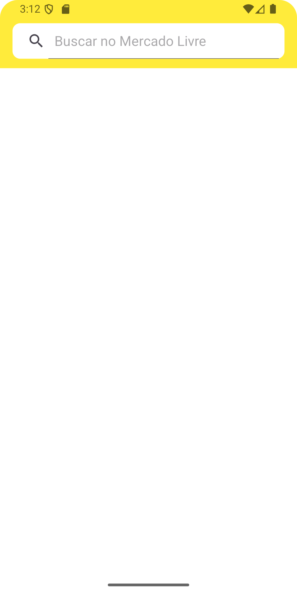
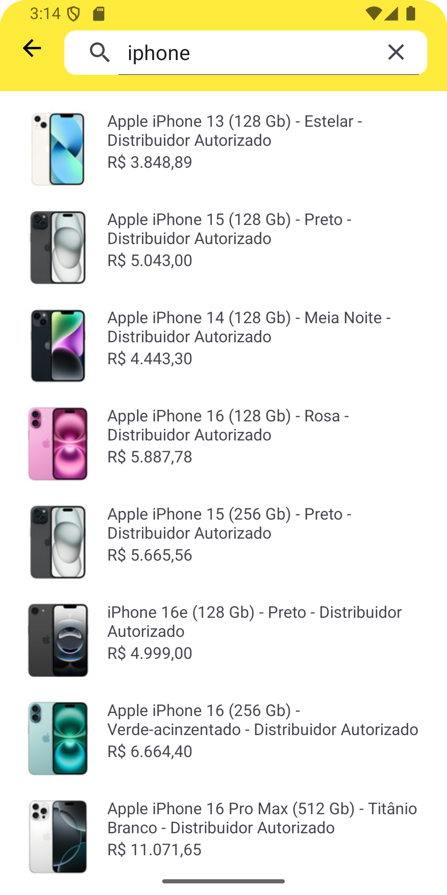
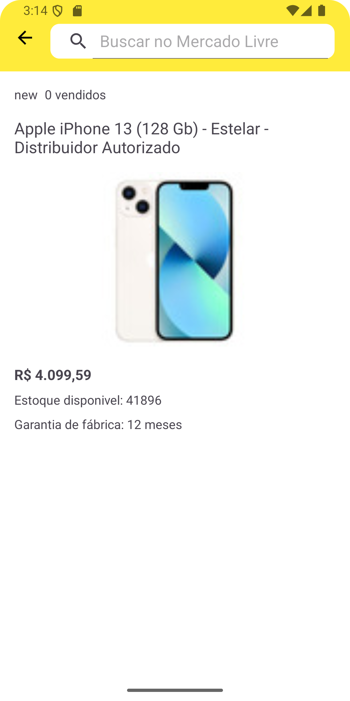

# Mercado Libre Mobile Candidate

## Features
 - Aplicativo android desenvolvido usando a [API](https://api.mercadolibre.com/) do mercado livre.
 - Pesquise de produtos na API e exiba-os em uma lista.
 - Ver detalhes de um produto.
 - Autenticação simples, usando webview para o teste ser possivel realizado.

### Este aplicativo foi desenvolvido usando Kotlin e utiliza os seguintes componentes:

- Jetpack components
- Coroutines
- Clean architecture (Domain, Data, Presentation)
- MVVM
- Repository pattern
- Use cases
- Livedata/Flow
- Mutable State
- Timber (Logs)
- Dagger Hilt (Dependency injection)
- Glide (Load images)
- Retrofit (HTTP requests)
- Pagination

## Arquitetura
O aplicativo é construído usando o padrão Clean Architecture baseado em [Architecture Components](https://developer.android.com/jetpack/guide#recommended-app-arch) no Android. O aplicativo é dividido em três camadas:

- Domínio: Esta camada contém a lógica de negócios da aplicação, aqui definimos os modelos de dados e os casos de uso.
- Dados: Esta camada contém a camada de dados da aplicação. Ela contém a rede e a implementação do repositório.
- Apresentação: Esta camada contém a camada de apresentação do aplicativo.

Search Screen | List products Screen | Details Screen
--- | --- | ---
 |  | 

## Tests

Comando para executar todos os unit tests:
```
./gradlew test
``` 
